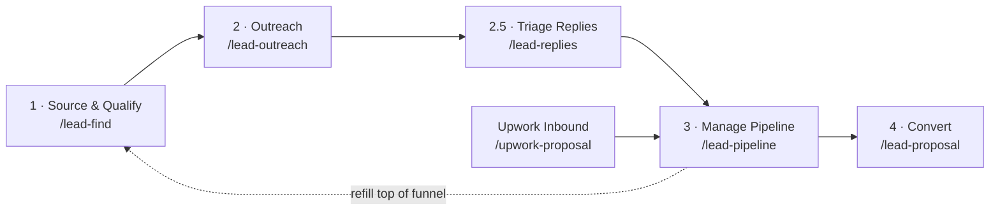

<p align="center">
  
  
  
  
</p>

# Autonomous B2B Outbound Engine

**A complete outbound sales system — sourcing, scoring, outreach, reply triage, and reporting — built entirely as a set of AI agent skills, running for a real business.**

This isn't a demo. It sources real decision-makers, sends real cold emails signed as the founder, tracks a real pipeline, and reports real results — for [Smart AI Workspace](https://smartaiworkspace.tech), a B2B AI automation consultancy. Every piece of it (the scoring rubric, the outreach cadence, the deliverability guardrails, the CRM abstraction) exists because a real sales process needed it, not because it looked good in a spec.

<p align="center"><i>Built by <a href="https://smartaiworkspace.tech">Tariq Osmani</a> — available to build the same for your business. See <a href="#hire-me">Hire Me</a>.</i></p>

---

## Table of Contents

- [What This Does](#what-this-does)
- [How It Works](#how-it-works)
- [Key Features](#key-features)
- [Built With](#built-with)
- [Guardrails](#guardrails)
- [Getting Started](#getting-started)
- [Onboarding a New Client](#onboarding-a-new-client)
- [Command Reference](#command-reference)
- [Project Structure](#project-structure)
- [Status](#status)
- [License](#license)
- [Hire Me](#hire-me)

---

## What This Does

Most "lead gen" tools stop at a list of names and emails. This system runs the **entire funnel** — from finding a decision-maker to closing a deal — as a set of AI agent skills that read and write a real CRM, send real email, and follow up without a human clicking send each time.

It's built **multi-tenant from day one**: every piece of business context (identity, ideal customer profile, scoring rubric, voice, pricing) lives in a `clients/<slug>/` folder of plain markdown. Point it at a new client, and the same 12 skills run the same funnel in that client's voice, against that client's CRM, with zero code changes.

## How It Works



A typical day: `/lead-pipeline` opens with the day's action list → the founder runs whatever it recommends (usually `/lead-outreach` or `/lead-replies`, sometimes `/lead-find` to refill the top). Two more skills run on their own schedule outside the daily loop: `/deliverability-monitor` (weekly inbox-health check) and `/lead-report` (weekly client-facing scorecard).

## Key Features

- **Source + qualify** — finds decision-makers by title, industry, seniority, and buying-intent signals (funding rounds, job changes, hiring spikes, tech-stack adoption), then enriches, verifies, dedupes, and scores each one 0–100 against the client's ICP rubric.
- **Autonomous, on-brand outreach** — drafts and sends cold email in the client's actual voice, picking from five proven copywriting frameworks (PAS, BAB, QVC, SCQ, 3C's) and rotating the angle across a 5-touch follow-up cadence.
- **Reply triage, not auto-reply** — classifies every inbound reply seven ways (interested, not-now, unsubscribe, bounce, etc.) and routes the pipeline accordingly, but never auto-answers a human. A reply that needs a booking link becomes a draft for the founder to review and send.
- **Buying-signal detection** — scans for funding events, executive job changes, hiring spikes, and tech-stack changes, and re-activates cold leads whose situation just changed.
- **Deliverability built in, not bolted on** — cold-email infrastructure (dedicated domains, SPF/DKIM/DMARC, mailbox warmup) gets provisioned once per client, then monitored weekly with a GREEN/YELLOW/RED verdict that automatically pauses sending if authentication or inbox placement degrades.
- **CRM-agnostic** — every skill talks to the pipeline through a 7-operation contract, not a specific API. Airtable and Instantly are fully wired; HubSpot and GoHighLevel are documented stubs, so wiring in a client's existing CRM is a scoped, well-defined task.
- **White-label ready** — the weekly client report can be rebranded end-to-end for agency resale, with all vendor mentions stripped.
- **Guided client onboarding** — `/client-intake` runs a structured interview and writes a new client's entire configuration in one pass.

## Built With

| Layer | Tool |
|---|---|
| Agent runtime | [Claude Code](https://claude.com/claude-code) skills (12 skills, no custom app to deploy) |
| Sourcing + enrichment | Explorium / Vibe Prospecting MCP |
| Pipeline / CRM | Airtable MCP (default) — pluggable via an adapter layer, Instantly also wired |
| Outreach | Gmail MCP (autonomous send) |
| Proposals & reporting | Google Drive / Docs MCP |
| Scripts | Python (stdlib only — dedupe, email verification, DNSBL checks, infra sizing) |

## Guardrails

An autonomous system that emails real people and spends real money needs real limits. A few of the ones baked into every client, not just this one:

- **Honesty** — never implies client results or cites numbers the active client hasn't explicitly authorized. No fabricated case studies, ever.
- **Voice** — no em dashes, no AI filler ("I hope this finds you well," "wanted to reach out") in any outreach or proposal copy. A draft that fails the check gets rewritten, not shown.
- **Dedupe** — one contact per company in the pipeline, always checked before a new record is created.
- **Spend gates** — anything that costs money (enrichment credits, sending domains) shows an itemized estimate and waits for an explicit yes before it runs.
- **Deliverability circuit breaker** — a RED verdict from the weekly health check pauses outbound sending for the affected domain until the cause is fixed.
- **Human-in-the-loop where it matters** — LinkedIn messages are always paste-ready text a human sends by hand; a reply that needs a real answer is left as a draft, never auto-sent.

Full guardrail list: [CLAUDE.md](CLAUDE.md).

## Getting Started

### Prerequisites

- [Claude Code](https://claude.com/claude-code)
- Python 3.10+
- Node.js (for the Airtable MCP server)
- MCP connections: Airtable, Gmail, Google Drive, and Explorium/Vibe Prospecting

### Setup

```bash
cp .env.example .env
# fill in .env: ACTIVE_CLIENT=smart-ai-workspace, plus any LLM/API keys you're using

python scripts/check_client.py   # → "clients/<slug>/ OK"
python scripts/normalize.py      # → "all checks passed"
```

The Airtable connector reads its Personal Access Token from `.mcp.json` (gitignored, never committed). Per-client sending identity and CRM base/table live in `clients/<slug>/identity.md`, not `.env`. For cold-email deliverability, point the Gmail "send as" alias at the client's `from-email` domain before running outreach.

## Onboarding a New Client

Fastest path — one command:

```bash
/client-intake <slug>
```

This runs a guided interview and writes all five config files for you. By hand instead:

1. `cp -r clients/smart-ai-workspace clients/<new-slug>`
2. Edit all five files, starting with `identity.md`.
3. Set `ACTIVE_CLIENT=<new-slug>` in `.env`, or pass `client=<new-slug>` on any single run.
4. `python scripts/check_client.py` should print OK.
5. Wire the CRM: confirm the Airtable token can reach the new base, or set up another adapter per `docs/pipeline-adapters/<target>.md`.
6. `/inbox-setup volume=<daily target>` — stands up sending domains, mailboxes, DNS auth, and warmup.

## Command Reference

<details>
<summary><b>Onboarding</b></summary>

| Command | Purpose |
|---|---|
| `/client-intake <slug>` | Guided interview that writes and validates a new `clients/<slug>/` config. |
| `/inbox-setup volume=<n>` | Stands up cold-email sending domains, mailboxes, DNS auth, warmup. Buys domains only on your explicit yes. |

</details>

<details>
<summary><b>The daily funnel</b></summary>

| Command | Purpose |
|---|---|
| `/lead-pipeline` | Start here. Daily action list, stage counts, conversion rates, stale/cold flags. |
| `/lead-find <industry>` | Sources, enriches, verifies, dedupes, and scores new leads (shows credit cost first). |
| `/lead-import file=<csv>` | Ingests a warm list or a website-visitor de-anonymization export instead of cold sourcing. |
| `/lead-signals` | Re-scans the existing pipeline for fresh buying signals and re-activates cold leads. |
| `/lead-outreach` | Drafts and sends the day's first-touches and follow-ups. |
| `/lead-replies` | Classifies inbound replies and routes the pipeline; drafts (never sends) a booking reply. |
| `/lead-proposal <company>` | After a discovery call, builds a 3-option fixed-scope proposal as a Google Doc. |
| `/upwork-proposal` | Paste an Upwork job post, get a tailored short proposal. |

</details>

<details>
<summary><b>Ops health (recurring)</b></summary>

| Command | Purpose |
|---|---|
| `/deliverability-monitor` | Weekly (or on demand) bounce/auth/blocklist/reply-rate check with a GREEN/YELLOW/RED verdict. |
| `/lead-report` | Weekly client-facing scorecard — branded Google Doc plus an Airtable dashboard. |

</details>

Every command runs against `ACTIVE_CLIENT`; add `client=<slug>` to any invocation to override for a single run. Full routing logic: [CLAUDE.md](CLAUDE.md).

## Project Structure

<details>
<summary>Expand</summary>

```
CLAUDE.md                    router + active-client model + onboarding
clients/<slug>/              per-client identity, icp, scoring, voice, offer
docs/pipeline-contract.md    target-neutral pipeline operations + lead fields
docs/pipeline-adapters/      one doc per crm_target (airtable, instantly, hubspot, gohighlevel)
docs/pipeline-schema.md      Airtable field reference
docs/outreach-playbook.md    global cadence + hard voice rules
docs/signal-catalog.md       buying-signal catalog + Explorium event mapping
scripts/normalize.py         dedupe helper + self-check
scripts/check_client.py      active-client config check (+ CRM wiring check)
scripts/inbox_math.py        cold-email infra sizing + self-check
scripts/verify_email.py      free-tier email verification + self-check
scripts/dnsbl_check.py       blocklist check + self-check
.claude/skills/              all 12 skills — funnel + onboarding + ops health
```

`/lead-report` appends to `clients/<slug>/report-log.md`; `/inbox-setup` and `/deliverability-monitor` write to `clients/<slug>/infrastructure.md`. Both are per-client runtime records, not committed config.

</details>

## Status

Ships with one live client, **smart-ai-workspace**. The pipeline runs in Airtable; the first cohort of real leads has moved through sourcing, scoring, and outreach with Gmail drafts in flight. Cold-email authentication (SPF/DKIM/DMARC) is confirmed passing end-to-end.

## License

[MIT](LICENSE)

## Hire Me

I build systems like this one — sourcing, outreach, CRM, and reporting wired together as autonomous agent skills, not a pile of disconnected tools. If you want the same for your business:

- **Website:** [smartaiworkspace.tech](https://smartaiworkspace.tech)
- **Email:** [tariq@smartaiworkspace.tech](mailto:tariq@smartaiworkspace.tech)
- **Upwork:** [Hire me on Upwork](https://www.upwork.com/freelancers/~013c026e8e2d951ba3)
